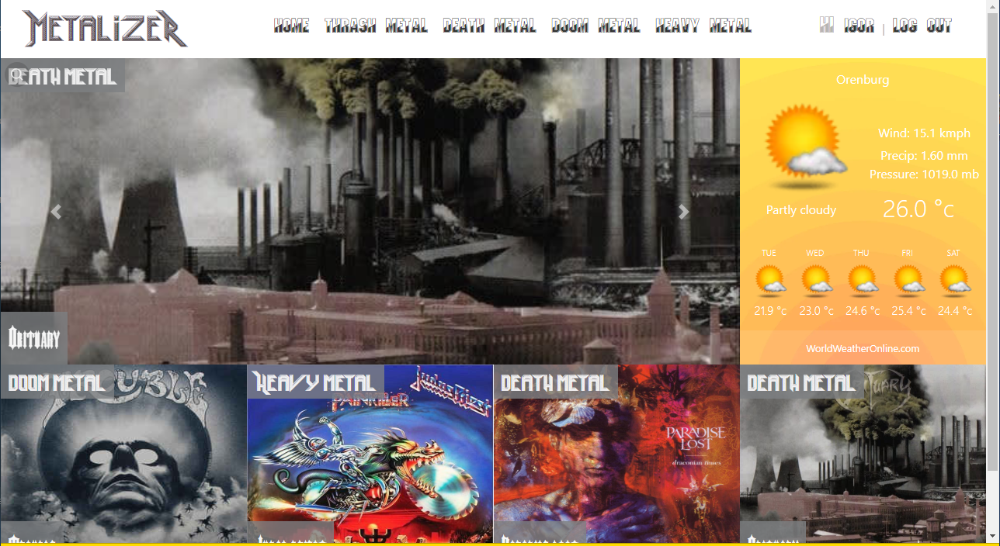
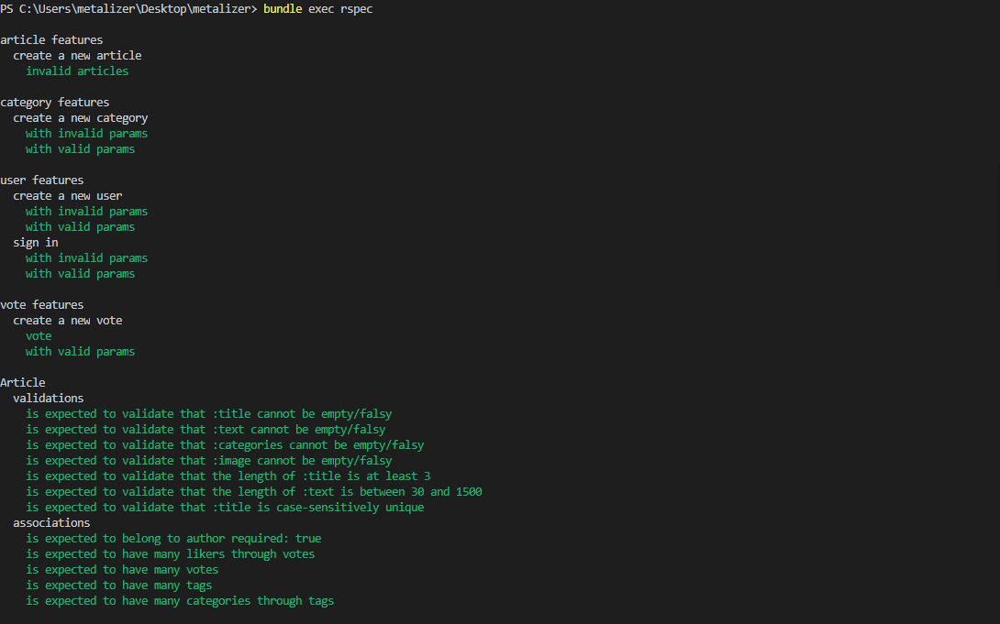

<!--
*** Thanks for checking out this README Template. If you have a suggestion that would
*** make this better, please fork the repo and create a pull request or simply open
*** an issue with the tag "enhancement".
*** Thanks again! Now go create something AMAZING! :D
-->

<!-- PROJECT SHIELDS -->
<!--
*** I'm using markdown "reference style" links for readability.
*** Reference links are enclosed in brackets [ ] instead of parentheses ( ).
*** See the bottom of this document for the declaration of the reference variables
*** for contributors-url, forks-url, etc. This is an optional, concise syntax you may use.
*** https://www.markdownguide.org/basic-syntax/#reference-style-links
-->
[![Contributors][contributors-shield]][contributors-url]
[![Forks][forks-shield]][forks-url]
[![Stargazers][stars-shield]][stars-url]
[![Issues][issues-shield]][issues-url]


<!-- PROJECT LOGO -->
<br />
<p align="center">
  <a href="https://github.com/vzdrizhni/metalizer">
    
  </a>

  <h3 align="center">RoR / Capstone --> [metalizer]</h3>

  <p align="center">
    This project is the Capstone of the Microverse curriculum at the end of the Ruby on Rails module!
    <br />
    <a href="https://github.com/vzdrizhni/metalizer"><strong>Explore the docs »</strong></a>
    <br />
    <br />
    <a href="https://github.com/vzdrizhni/metalizer/issues">Report Bug</a>
    ·
    <a href="https://github.com/vzdrizhni/metalizer/issues">Request Feature</a>
  </p>
</p>

<!-- TABLE OF CONTENTS -->
## Table of Contents

* [About the Project](#about-the-project)
  * [Built With](#built-with)
* [Installation](#installation)
* [Database Structure](#database-structure)
* [Live Demo and Presentation](#live-demo-and-presentation)
* [Contributors](#contributors)
* [Acknowledgements](#acknowledgements)
* [License](#license)

<!-- ABOUT THE PROJECT -->
## About The Project

This is the Capstone project that signs the completion of the RubyOnRails module in Microverse Curriculum.
It is a webapp where users can register using name, username, password and can signin with their username only.
As a logged in user, it is possible to create articles, edit profile, comment, vote and bookmark an article for future reads.
The app can be used also on read only mode, with restricted access to its features.



<!-- INSTALLATION -->
## Installation

To have this app on your pc, you need to:
* have Ruby & Ruby on Rails installed in your computer
* [download](https://github.com/vzdrizhni/metalizer/archive/development.zip) or clone this repo: 
 
  - Clone with HTTPS
  ```
    https://github.com/vzdrizhni/metalizer.git
  ```
* and open the terminal inside the repo and run the bundler
  - ```$ bundler install --without production```
* then, run rails db:migrate && rails db:seed. This creates the database with the corresponding tables, columns and associations and will populate the database with mockup content
  - ```$ rails db:migrate```
* and finally, you can test it in the console by running
  - ```$ rails server``` and using ```localhost:3000``` into your browser address bar to start using it

  ## Rspec testing

* Run the command and see the output:
```$ bundle exec rspec```


## Database Structure
 * Database schema used for this project reflects the following structure:
 

### Built With
This project was built using these technologies.
* Ruby & Ruby on Rails
* Rspec / Capybara
* Bootstrap
* HTML / CSS / SCSS
* SQLite
* Rubocop
* GithubActions :muscle:
* Atom

<!-- Live Demo -->
## Live Demo and Walkthrough Video
* Live Demo Link: - Heroku Deployment - [metalizer](https://fathomless-atoll-13027.herokuapp.com/articles) :point_left:
## WalkThrough Video:
https://www.loom.com/share/a4b5d729b10a4f88ac7e8365e81e2444
## Potential future features
- Add fully working weather API
- Extend the Authorisation feature
- Improve the front-end

<!-- CONTACT -->
## Contributors

👤 **Roman Nikolaev**

- LinkedIn: [Nikolaev Roman](https://www.linkedin.com/in/roman-nikolaev-65b639197/)
- GitHub: [@vzdrizhni](https://github.com/vzdrizhni)
- E-mail: vzdrizhni@gmail.com


<!-- ACKNOWLEDGEMENTS -->
## Acknowledgements
* [Microverse](https://www.microverse.org/)
* [Ruby Documentation](https://www.ruby-lang.org/en/documentation/)
* [Ruby on Rails](https://rubyonrails.org/)
* [Behance](https://www.behance.net/)
* [Heroku](https://www.heroku.com/)

## Credits
* Nelson Sakwa - [liFEstIye](https://www.behance.net/gallery/14554909/liFEsTlye-Mobile-version)

<!-- MARKDOWN LINKS & IMAGES -->
<!-- https://www.markdownguide.org/basic-syntax/#reference-style-links -->
[contributors-shield]: https://img.shields.io/github/contributors/vzdrizhni/metalizer.svg?style=flat-square
[contributors-url]: https://github.com/vzdrizhni/metalizer/graphs/contributors
[forks-shield]: https://img.shields.io/github/forks/vzdrizhni/metalizer.svg?style=flat-square
[forks-url]: https://github.com/vzdrizhni/metalizer/network/members
[stars-shield]: https://img.shields.io/github/stars/vzdrizhni/metalizer.svg?style=flat-square
[stars-url]: https://github.com/vzdrizhni/metalizer/stargazers
[issues-shield]: https://img.shields.io/github/issues/vzdrizhni/metalizer.svg?style=flat-square
[issues-url]: https://github.com/vzdrizhni/metalizer/issues

## 📝 License

This project is [MIT](https://opensource.org/licenses/MIT) licensed.
